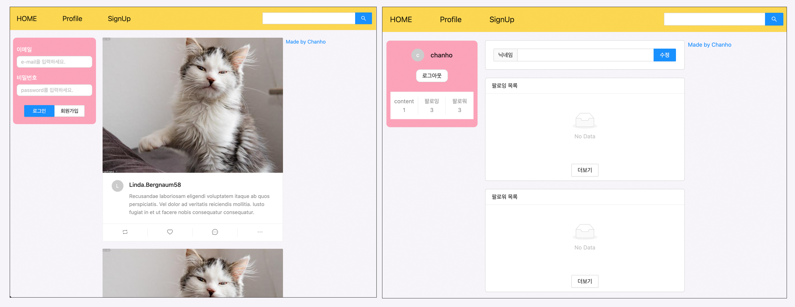
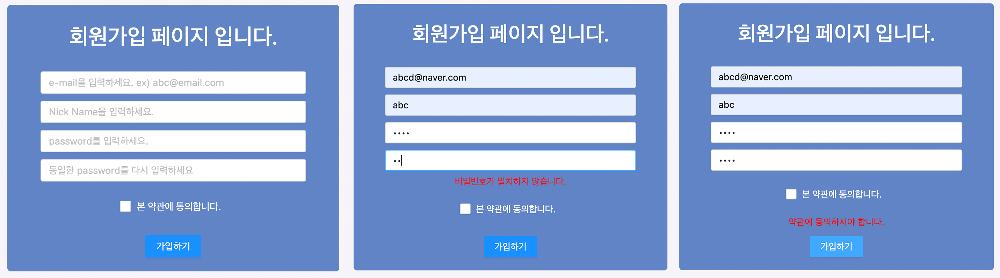
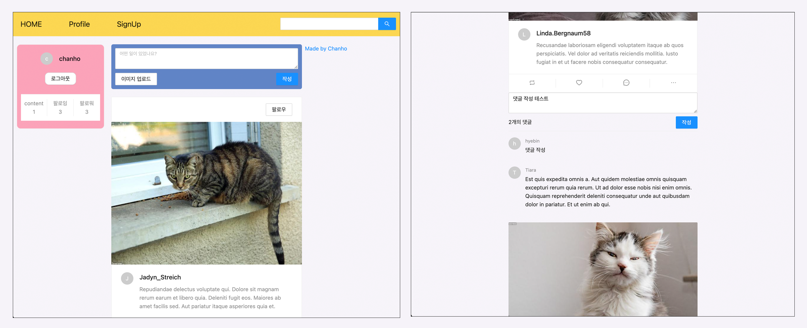

# CREATE_SNS_Project :: SNS FULL STACK 구현

## 프로젝트 소개

SNS 웹페이지 풀스택 구현 프로젝트:: Local Develop Branch

배포되는 Main Branch에 올리기전에 기능 추가 테스트 및 최적화를 위한 로컬 브랜치 입니다.

## 기술 스택

<h1>📚 STACKS</h1>

 
  
  
  
  
   
  
  
  
  
  
   
  
  
  
  
   

## Preview

<h3>Preview1</h3>

## Color

- #1C6DD0 \_ 파랑계열 (프로필 배경)
- #5F9DF7 \_ 파랑계열 (서브컬러)
- #FFF7E9 \_ 베이지 계열 (커맨트)
- #E6CBA8 \_ 구분선

## 업데이트 예정

- 팔로잉 게시글만 불러오기 구현

- 댓글 수정 & 삭제 구현

- 좋아요 게시글 목록 구현

- 닉네임 검색 기능 구현

- 상태메세지 구현

- 메세지 기능 구현

## 수정 예정

[ 버그 내용 ] -> [ 수정_날짜 ]

### [ “ Application error: a client-side exception has occurred (see the browser console for more information “ cat, dog 카테고리내에서 댓글 클릭 시 위 에러 발생 _ (수정) server의 router에서 hashtag를 불러올때 댓글을 받아오지 않아 문제가 발생하여, include내에 comment 추가] -> [22.12.18]

### [ dog,cat 카테고리 게시글 최신 게시글이 상단으로 변경 및 프로필 이미지 안뜸 문재 해결] -> [22.12.18]

### [프로필페이지 PC화면에서 컴포넌트 사이즈 이상으로 화면 구성이 망가진다] -> [22.11.19]

### [Nav Update] -> [2022-11-16]

모바일 환경에서 Sider사용시 비효율적 화면 구성으로 인해 모바일 환경에서는 TopNav환경 구성

## History

## ip 체크 기능 구현 \_ 2020/11/22

#### Database에 저장된 현재 연결된 ip주소와 다른 곳에서 로그인을 시도시 기존 로그인을 해지

## 댓글 삭제 구현 \_ 2020/11/21

## LandingPage 로그인시 팔로우한 게시글만 불러오기 기능 구현 \_ 2022/11/19

## 회원가입에 필요한 정보 추가 및 UI 변경 \_ 2022/11/19

## 로그인폼 & 프로필 UI 및 메인컬러 변경 \_ 2022/11/18

## 프로필이미지 구현 \_ 2022/11/17

## 랜딩페이지 및 네브바 업데이드 \_ 2022/11/16

## 카테고리 구현 \_ 2022/11/16

## 신고하기 기능 구현 \_ 2022/11/16

## Local Branch 생성 \_ 2022/10/12

## Web Service Func \_ ~2022/09/15

1. 게시글 수정 구현

## Web Service [ AWS ] \_ ~2022/09/15

1. Let'sEncrypt 인증서 발급 및 cron 이용 자동 갱신 적용

2. 프론트서버 nginx + https 적용

3. 백엔드서버 https 적용

## Distribute Web Service [ AWS ] \_ ~2022/09/14

1. EC2 생성 및 노드, MySQL, pm2 환경 구성

2. 프론트 서버, 백엔드 서버 배포

3. 도메인 연결 \_ 가비아 구매

4. 이미지 저장 \_ S3 연결

5. 이미지 리사이징 \_ Lambda

## ServerSideRendering Complete \_ 2022/09/08

1. 디자인 최종 수정

2. 시퀄라이즈 최신 문법 적용

3. immer 확장 (익스플로러11)

## ServerSideRendering Setting \_ ~2022/09/07

1. 사용자 게시글, 해시태그 게시글 불러오기 구현

2. getStaticPaths 적용

3. Profile Page swr 적용

4. 해시태그 검색기능 추가

5. Moment 라이브러리 이용 -> 게시글 작성일 표시

6. 커스텀 웹팩 작성 및 빌드 하기

7. 디자인 수정

## ServerSideRendering Setting \_ 2022/08/30

1. getStaticProps 이용 about 페이지 생성
2. 다이나믹 라우팅 적용
3. css ssr 적용

## ServerSideRendering Setting \_ 2022/08/28 ~ 2022/08/29

- 버그로 인해 28일 작업 초기화후 다시 진행

1. SSR 사전 setting
2. SSR시 쿠키 공유하기

## 서버 5차 구현 \_ 2022/08/27

1. 리트윗 기능 구현
2. Fix: 게시글 삭제시 화면 적용 안됨 문제 수정(직접 리렌더링을 해야 적용)

- commit: "Feat: Implement Retweet"

3. Fix: 게시글 스크롤 이벤트 'lastId' 적용
4. Implement CSR Server
5. Create: "Implement CSR SERVER"

## 서버 5차 구현 \_ 2022/08/26

1. MySQL schema 수정
2. 프로필 페이지 팔로우, 언팔로우 목록 제공

- commit: "Fix: Bug fixes and profile page updates"

3. 게시글 이미지 업로드 구현 - 이미지 선택, 미리보기 및 제거 기능 제공

- commit: "Feat: Implement image upload"

4. 해시태그 등록 구현 - db 연동

- commit: "Implement hashtag registration"

## 서버 4차 구현 \_ 2022/08/23

1. 팔로우, 언팔로우 기능 구현
2. 로그아웃 버그 수정 (Axios error)

## 서버 3차 구현 \_ 2022/08/20

1. 리렌더링시 로그인 정보 불러오기 구현
2. 게시글 좋아요 기능 구현
3. 게시글 제거 기능 구현
4. 닉네임 변경 기능 추가

## 서버 2차 구현 \_ 2022/08/19

1. 실제 게시글 작성 구현 게시글 작성 -> DB
2. 실제 댓글 작성 구현.
3. credentials로 쿠기 공유하기.
4. fatch: 미들웨어로 라우터 검사 추가.

## 서버 1차 구현 및 DB 구현 \_ 2022/08/18

1. MySQL 이용 데이터 베이스 구현 \_ Sequelize 사용하여 관계형 모델 생성
2. CORS 해결
3. 회원가입 구현
4. 로그인 & 로그아웃 구현
5. 로직 최적화

## Front-End 1차 구현 \_ 2022/08/17 (완)

### 랜딩 페이지 & 프로필 페이지

 

### 회원가입 페이지

 

1. 회원가입페이지 구현
2. 인풋 커스텀훅 작성

 

### 게시글 작성 & 댓글 작성

 

1. 게시글 구현
2. 댓글 구현
3. 이미지 구현
4. 이미지 캐루셀 구현
5. 게시글 해시태그 링크 구현
6. 인피니트 스크롤링 구현
7. 팔로우, 언팔로우 구현

## 추가 필요 개선 사항
